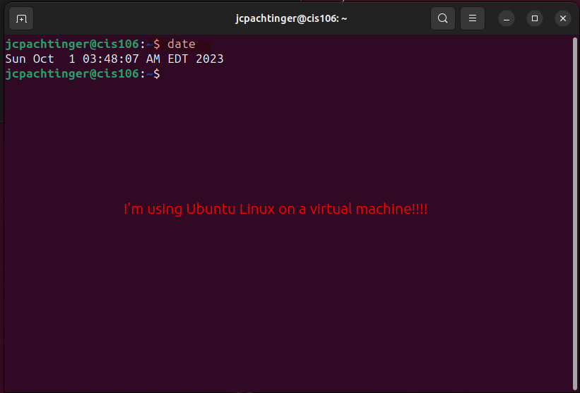
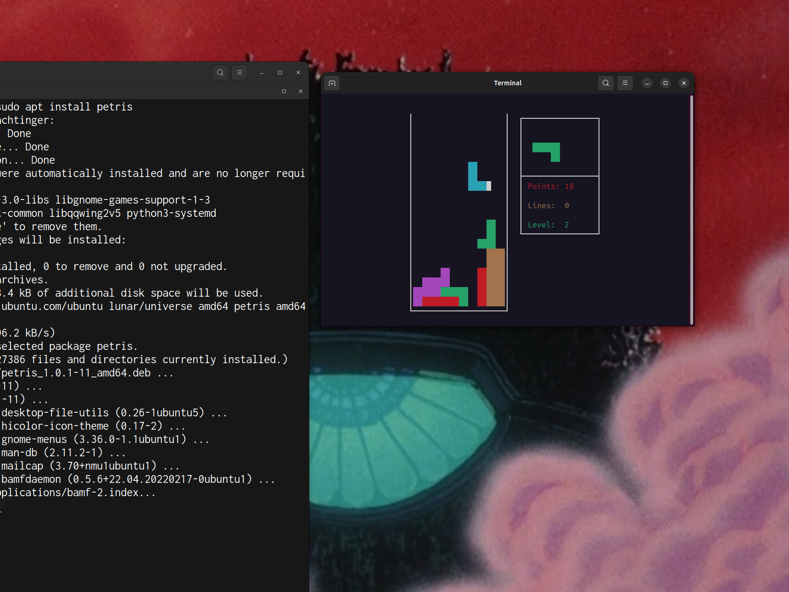
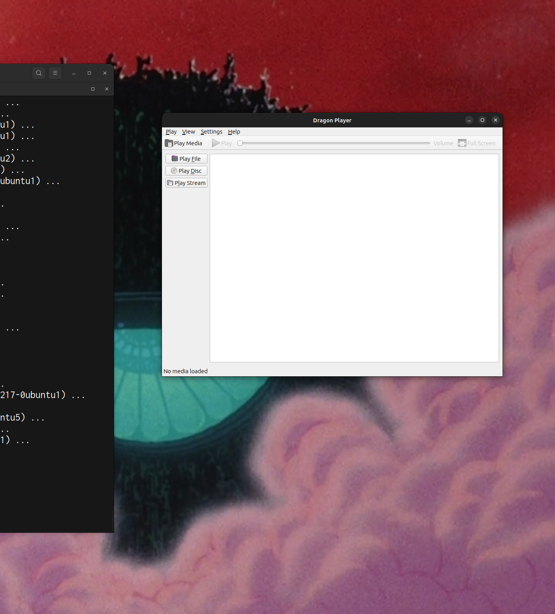
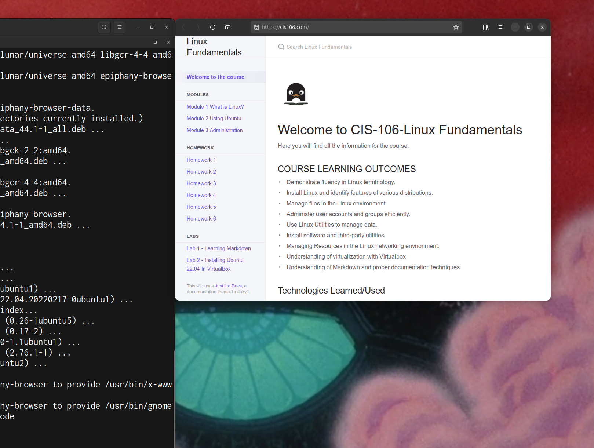
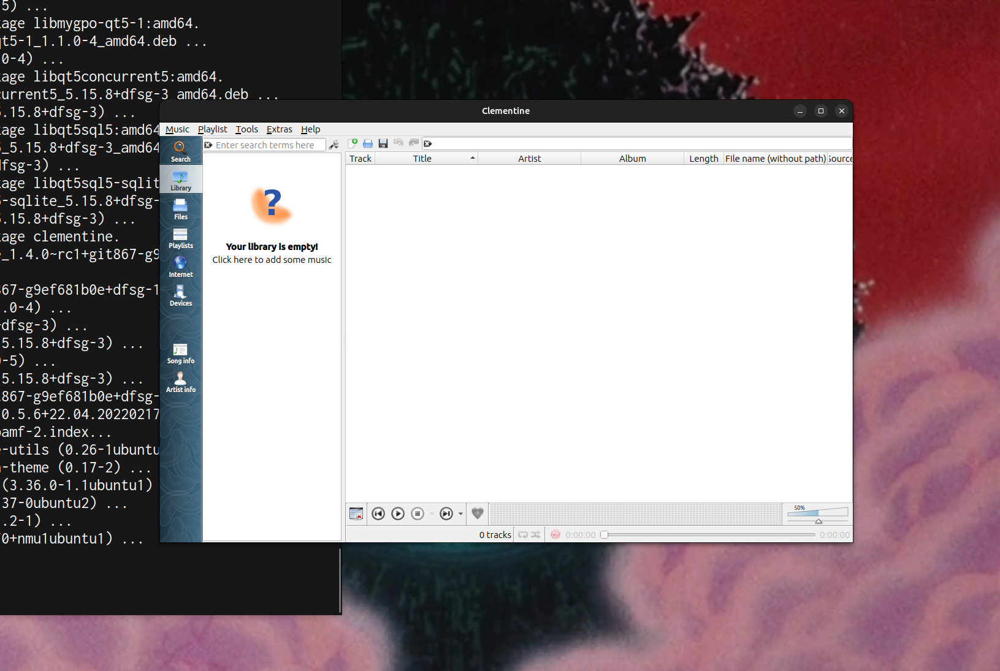
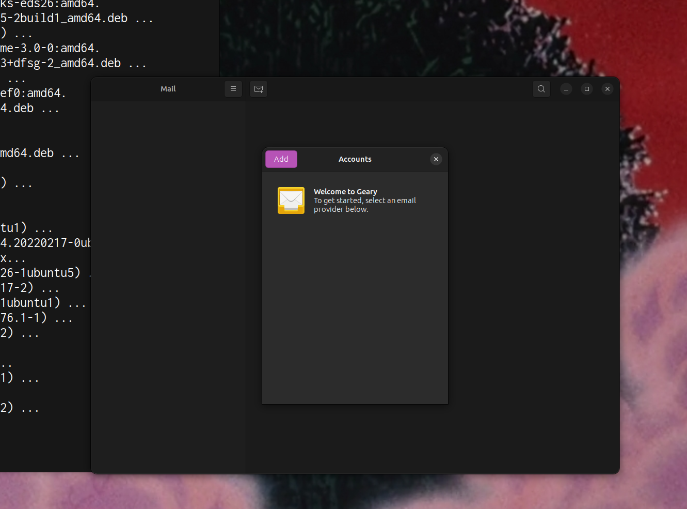

# Lab 3 Using Ubuntu

## Question 1

## Question 2

## Question 3

## Question 4
|command|what it does|
|---|---|
|echo|displays a line of text|
|fortune|prints a random adage|
|cowsay|prints a cow saying a given message|
|lolcat|adds a rainbow color effect to displayed text|
|figlet|prints given text as large letters made of smaller characters|
|toilet|same functionality as figlet but with extra features|
|rig|creates a fake identity with a name, address, and telephone number|
|boxes|draws a variety of boxes around given text|
