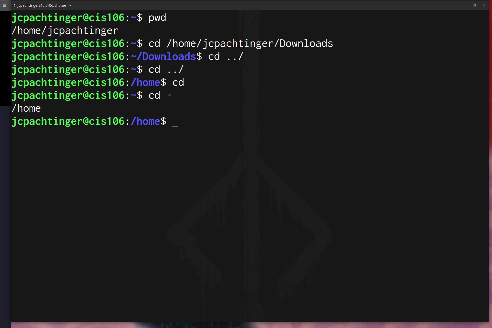
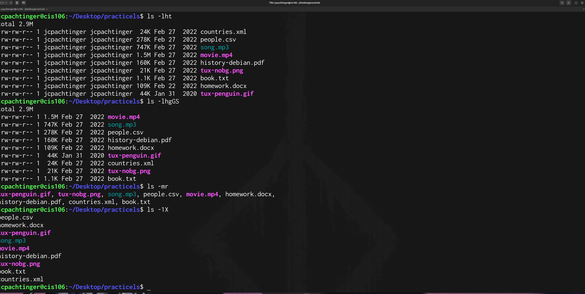
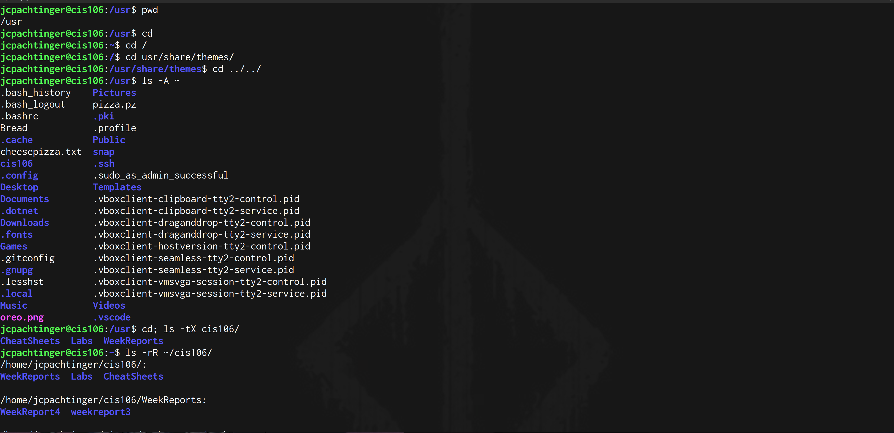
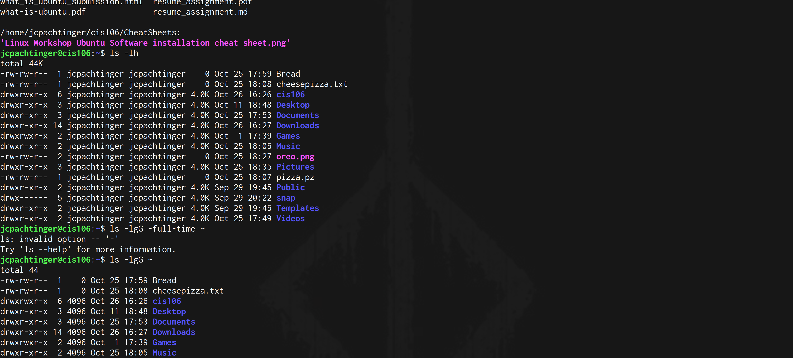
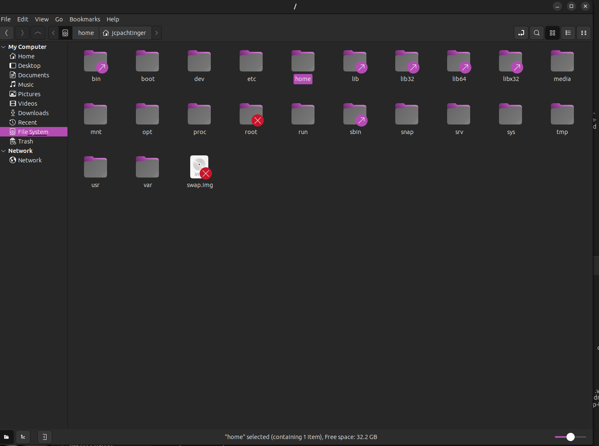
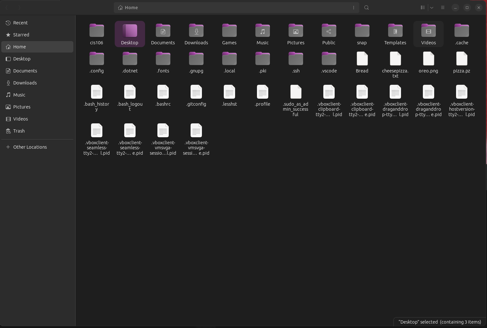

---
Jerry Pachtinger
CIS 106
Fall 2023
---

# Week Report 4

## Practice

### Practice 1

### Practice 2

### Challenge

## Linux file system directories

### Root
The root directory is at the top of the tree. Only the administrator has access to the root. It contains important system files and it leads into the home directories for users and 

### Home
The home directory is where individual users have control. A user is free to access and change anything within their home directory

## Commands

|command|what it does|syntax|example|
|---|---|---|---|
|pwd|displays your current working directory| pwd | pwd|
|cd| changes your curren working directory| cd + destination | cd ~/Downloads/ |
|ls | listing the contents of a directory | ls + option + directory to list | ls -l ~/downloads/|

## Basic terminology
**File system** - The way in which files are stored and organized
**Current directory** - The folder that you are located in and have direct access to
**Parent directory** - The directory that you your current directory is contained within
**Your Home** - the directory that your username has access to
**Home** - Directory that contains all user's home directories
**Pathname**- like a set of directions that indicates where a file is located in the filesystem
**Relative Path** - The way to a file starting from the current working directory
**Absolute Path** - The complete location of a file starting at the root