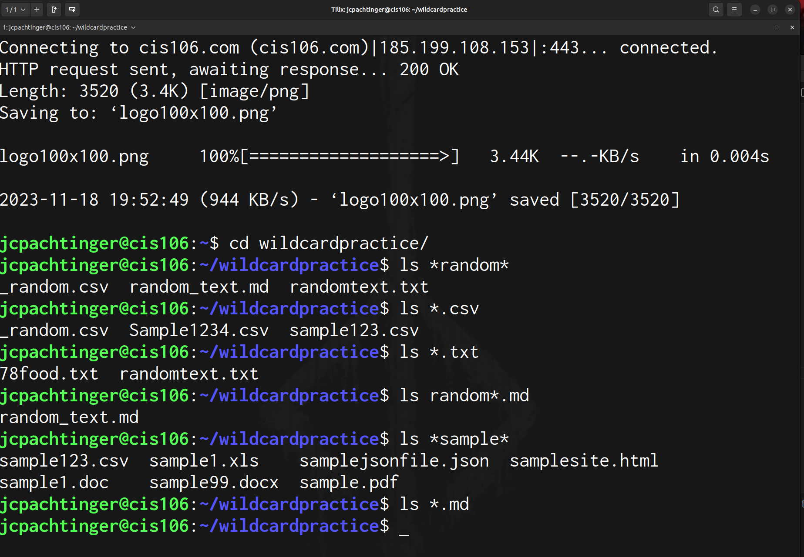
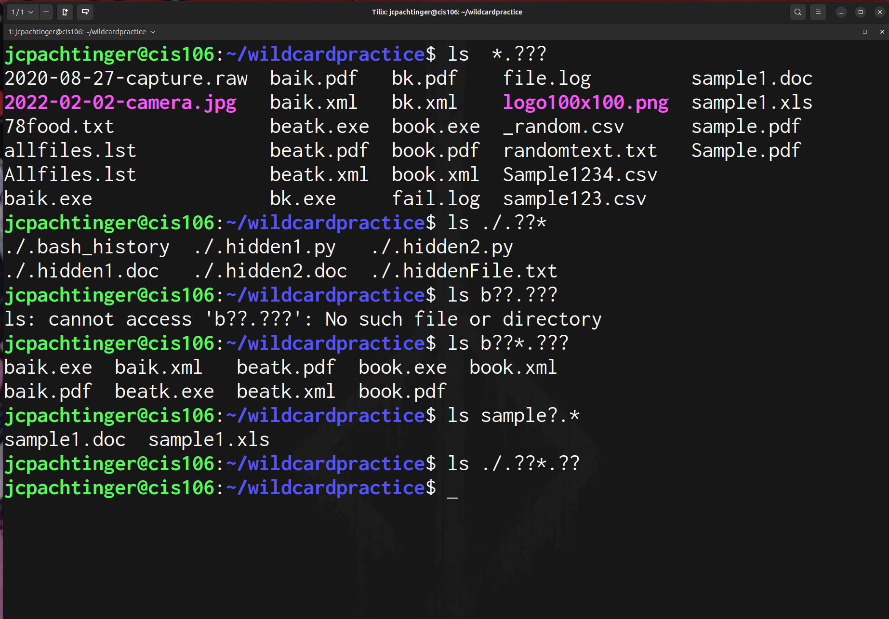
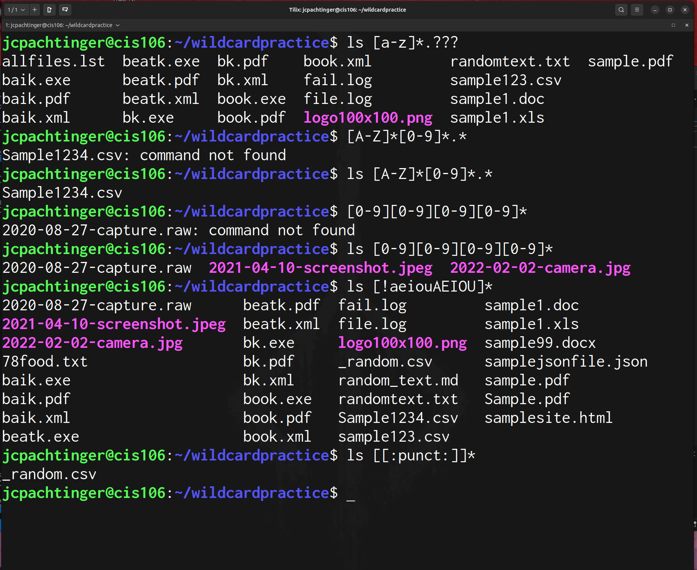

---
Jerry Pachtinger
Fall 2023
CIS 106
---

**The * Wildcard**
Will match anything or nothing so it should be used in addition to characters you know you're looking for otherwise your search will return everything

ex 1: ls *.md 
Will list everything the ends with the .md file extension

ex 2: ls Jerry*
If you're using a naming convention that starts with a person's name it will list all the files attributer to "Jerry"

ex 3: ls File.*
Will list everything named "File" under any file extension

**The ? Wildcard**
The ? wildcard matches one character. Can be used to find hidden files

ex 1: ls ./.??*
Lists all hidden files in the current directory

ex 2: ls ../.??*
Lists all the hidden files in the parent directory

ex 3: ls *.?? 
Lists all files with a two character file extension

ex 4: *_19??_*.txt
Will search for all files dated  1900-1999 

**The [] Wildcard**
Brackets allow you to specify a set or range in which a single character may exist can be modified with ! to specify a set or range of characters to exclude from the search. Letters are case sensitive. Can be used with character classes

ex 1: ls [0-9]*
will list any file that starts with a number

ex 2: ls [a-zA-Z]*
will list any file starting with any letter, upper or lower case

ex 3:  ls [!0-9][!0-9][!0-9]*
will list files whose first three characters are not numbers

ex 4: ls *[[:space:]]*
will list any file with a whitespace character in the middle

**Brace Expansion**
Brace expansion is a bash feature that allows you to generate arbitrary strings to use with commands

ex 1: touch weeklyreport{1..8}.md
Will generate 8 weekly report files numbered 1 through 8

ex 2: mkdir -p  roms/{snes,genesis,tg16}/{rpg,shmup,platformer}
Will create a file structure. *note* -p option allows mkdir to create the necessary parent folders

ex 3: rm -r {poem.txt,dog.png,homework.py}
Remove multiple files in a directory

